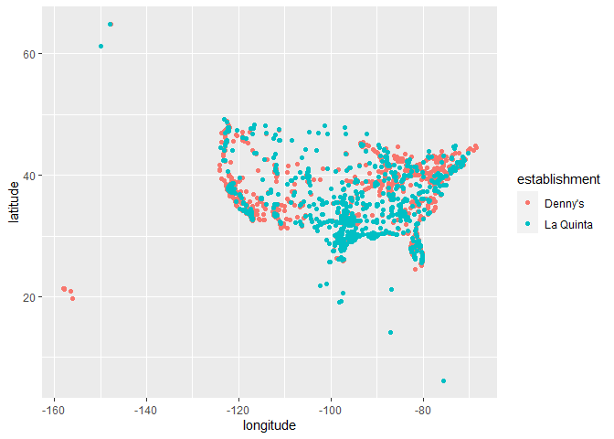
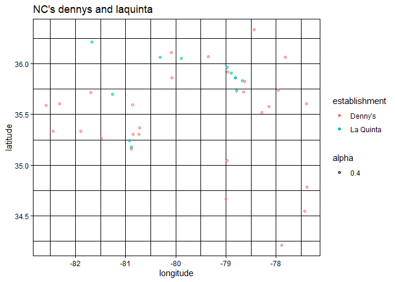
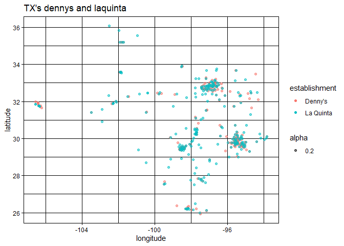

Lab 04 - Visualizing spatial data
================
Jessie
01/31

### Load packages and data

``` r
library(tidyverse) 
library(dsbox) 
```

``` r
states <- read_csv("data/states.csv")

library(ggplot2)
library(dplyr)

c <- dennys
d <- laquinta
```

### Exercise 1

What are the dimensions of the Denny’s dataset? 1643 rows 6 columns, the
variables are address, city, state, zip, longitude, latitude

``` r
nrow(dennys)
```

    ## [1] 1643

``` r
ncol(dennys)
```

    ## [1] 6

``` r
dim(dennys)
```

    ## [1] 1643    6

``` r
glimpse(dennys)
```

    ## Rows: 1,643
    ## Columns: 6
    ## $ address   <chr> "2900 Denali", "3850 Debarr Road", "1929 Airport Way", "230 …
    ## $ city      <chr> "Anchorage", "Anchorage", "Fairbanks", "Auburn", "Birmingham…
    ## $ state     <chr> "AK", "AK", "AK", "AL", "AL", "AL", "AL", "AL", "AL", "AL", …
    ## $ zip       <chr> "99503", "99508", "99701", "36849", "35207", "35294", "35056…
    ## $ longitude <dbl> -149.8767, -149.8090, -147.7600, -85.4681, -86.8317, -86.803…
    ## $ latitude  <dbl> 61.1953, 61.2097, 64.8366, 32.6033, 33.5615, 33.5007, 34.206…

### Exercise 2

909 rows 6 columns, the variables are address, city, state, zip,
longitude, latitude

``` r
nrow(laquinta)
```

    ## [1] 909

``` r
ncol(laquinta)
```

    ## [1] 6

``` r
dim(laquinta)
```

    ## [1] 909   6

``` r
glimpse(laquinta)
```

    ## Rows: 909
    ## Columns: 6
    ## $ address   <chr> "793 W. Bel Air Avenue", "3018 CatClaw Dr", "3501 West Lake …
    ## $ city      <chr> "\nAberdeen", "\nAbilene", "\nAbilene", "\nAcworth", "\nAda"…
    ## $ state     <chr> "MD", "TX", "TX", "GA", "OK", "TX", "AG", "TX", "NM", "NM", …
    ## $ zip       <chr> "21001", "79606", "79601", "30102", "74820", "75254", "20345…
    ## $ longitude <dbl> -76.18846, -99.77877, -99.72269, -84.65609, -96.63652, -96.8…
    ## $ latitude  <dbl> 39.52322, 32.41349, 32.49136, 34.08204, 34.78180, 32.95164, …

### Exercise 3

Take a look at the websites that the data come from (linked above). Are
there any La Quinta’s locations outside of the US? If so, which
countries? What about Denny’s?

la quinta also locates in Canada, China, Arab, new Zealand, Mexico,
turkey, chile, Columbia Denny’s locates in the united states only. …

### Exercise 4

Now take a look at the data. What would be some ways of determining
whether or not either establishment has any locations outside the US
using just the data (and not the websites). Don’t worry about whether
you know how to implement this, just brainstorm some ideas. Write down
at least one as your answer, but you’re welcomed to write down a few
options too.

I think I might filter out the zip code that does not belong to the
States. For instance, I would filter out the zip codes that are not
composed of 5 digits, and also those which does not start with states’
zip codes.

### Exercise 5

no rows are found, indicating there is no denny is located outside of
the states.

``` r
c %>%
  filter(!(state %in% states$abbreviation))
```

    ## # A tibble: 0 × 6
    ## # … with 6 variables: address <chr>, city <chr>, state <chr>, zip <chr>,
    ## #   longitude <dbl>, latitude <dbl>

### Exercise 6

…

``` r
c %>%
  mutate(country = "United States")
```

    ## # A tibble: 1,643 × 7
    ##    address                        city       state zip   longi…¹ latit…² country
    ##    <chr>                          <chr>      <chr> <chr>   <dbl>   <dbl> <chr>  
    ##  1 2900 Denali                    Anchorage  AK    99503  -150.     61.2 United…
    ##  2 3850 Debarr Road               Anchorage  AK    99508  -150.     61.2 United…
    ##  3 1929 Airport Way               Fairbanks  AK    99701  -148.     64.8 United…
    ##  4 230 Connector Dr               Auburn     AL    36849   -85.5    32.6 United…
    ##  5 224 Daniel Payne Drive N       Birmingham AL    35207   -86.8    33.6 United…
    ##  6 900 16th St S, Commons on Gree Birmingham AL    35294   -86.8    33.5 United…
    ##  7 5931 Alabama Highway, #157     Cullman    AL    35056   -86.9    34.2 United…
    ##  8 2190 Ross Clark Circle         Dothan     AL    36301   -85.4    31.2 United…
    ##  9 900 Tyson Rd                   Hope Hull… AL    36043   -86.4    32.2 United…
    ## 10 4874 University Drive          Huntsville AL    35816   -86.7    34.7 United…
    ## # … with 1,633 more rows, and abbreviated variable names ¹​longitude, ²​latitude

### Exercise 7

cancun Mexico partido lglesias Mexico Apodaca Mexico Medellin Colombia
Monterrey Mexico Monterrey Mexico Oshawa Canada Poza Rica Mexico San
Jose Chiapa Mexico Puebla mexico San Luis Potosi Mexico Tegucigalpa
Hunduras

``` r
d %>%
  filter(!(state %in% states$abbreviation))
```

    ## # A tibble: 14 × 6
    ##    address                                     city  state zip   longi…¹ latit…²
    ##    <chr>                                       <chr> <chr> <chr>   <dbl>   <dbl>
    ##  1 Carretera Panamericana Sur KM 12            "\nA… AG    20345  -102.    21.8 
    ##  2 Av. Tulum Mza. 14 S.M. 4 Lote 2             "\nC… QR    77500   -86.8   21.2 
    ##  3 Ejercito Nacional 8211                      "Col… CH    32528  -106.    31.7 
    ##  4 Blvd. Aeropuerto 4001                       "Par… NL    66600  -100.    25.8 
    ##  5 Carrera 38 # 26-13 Avenida las Palmas con … "\nM… ANT   0500…   -75.6    6.22
    ##  6 AV. PINO SUAREZ No. 1001                    "Col… NL    64000  -100.    25.7 
    ##  7 Av. Fidel Velazquez #3000 Col. Central      "\nM… NL    64190  -100.    25.7 
    ##  8 63 King Street East                         "\nO… ON    L1H1…   -78.9   43.9 
    ##  9 Calle Las Torres-1 Colonia Reforma          "\nP… VE    93210   -97.4   20.6 
    ## 10 Blvd. Audi N. 3 Ciudad Modelo               "\nS… PU    75010   -97.8   19.2 
    ## 11 Ave. Zeta del Cochero No 407                "Col… PU    72810   -98.2   19.0 
    ## 12 Av. Benito Juarez 1230 B (Carretera 57) Co… "\nS… SL    78399  -101.    22.1 
    ## 13 Blvd. Fuerza Armadas                        "con… FM    11101   -87.2   14.1 
    ## 14 8640 Alexandra Rd                           "\nR… BC    V6X1…  -123.    49.2 
    ## # … with abbreviated variable names ¹​longitude, ²​latitude

### Exercise 8

…

``` r
library(dplyr)
library(tidyverse)
d %>%
  mutate(country = case_when(state %in% state.abb     ~ "United States",
                             state == "ANT" ~ "Colombia",
                             state %in% c("ON", "BC") ~ "canada",
                             state %in% c("QR", "NL", "PU", "AG", "CH", "FM") ~"Mexico",
                             state == "FM" ~ "Hunduras" )) %>%
  filter(country == "United States")
```

    ## # A tibble: 895 × 7
    ##    address                         city      state zip   longi…¹ latit…² country
    ##    <chr>                           <chr>     <chr> <chr>   <dbl>   <dbl> <chr>  
    ##  1 793 W. Bel Air Avenue           "\nAberd… MD    21001   -76.2    39.5 United…
    ##  2 3018 CatClaw Dr                 "\nAbile… TX    79606   -99.8    32.4 United…
    ##  3 3501 West Lake Rd               "\nAbile… TX    79601   -99.7    32.5 United…
    ##  4 184 North Point Way             "\nAcwor… GA    30102   -84.7    34.1 United…
    ##  5 2828 East Arlington Street      "\nAda"   OK    74820   -96.6    34.8 United…
    ##  6 14925 Landmark Blvd             "\nAddis… TX    75254   -96.8    33.0 United…
    ##  7 909 East Frontage Rd            "\nAlamo" TX    78516   -98.1    26.2 United…
    ##  8 2116 Yale Blvd Southeast        "\nAlbuq… NM    87106  -107.     35.1 United…
    ##  9 7439 Pan American Fwy Northeast "\nAlbuq… NM    87109  -107.     35.2 United…
    ## 10 2011 Menaul Blvd Northeast      "\nAlbuq… NM    87107  -107.     35.1 United…
    ## # … with 885 more rows, and abbreviated variable names ¹​longitude, ²​latitude

Dennys: DE has the lowest amount of dennys and CA has the highest. La
Quintas: TX has the highest amount of laquintas and foreign countries
has the lowest amount. not surprising because it’s where people want to
spend their holidays.

``` r
d %>%
  count(state)
```

    ## # A tibble: 59 × 2
    ##    state     n
    ##    <chr> <int>
    ##  1 AG        1
    ##  2 AK        2
    ##  3 AL       16
    ##  4 ANT       1
    ##  5 AR       13
    ##  6 AZ       18
    ##  7 BC        1
    ##  8 CA       56
    ##  9 CH        1
    ## 10 CO       27
    ## # … with 49 more rows

``` r
c  %>%
  count(state)
```

    ## # A tibble: 51 × 2
    ##    state     n
    ##    <chr> <int>
    ##  1 AK        3
    ##  2 AL        7
    ##  3 AR        9
    ##  4 AZ       83
    ##  5 CA      403
    ##  6 CO       29
    ##  7 CT       12
    ##  8 DC        2
    ##  9 DE        1
    ## 10 FL      140
    ## # … with 41 more rows

``` r
c %>%
  count(state) %>%
  inner_join(states, by = c("state" = "abbreviation"))
```

    ## # A tibble: 51 × 4
    ##    state     n name                     area
    ##    <chr> <int> <chr>                   <dbl>
    ##  1 AK        3 Alaska               665384. 
    ##  2 AL        7 Alabama               52420. 
    ##  3 AR        9 Arkansas              53179. 
    ##  4 AZ       83 Arizona              113990. 
    ##  5 CA      403 California           163695. 
    ##  6 CO       29 Colorado             104094. 
    ##  7 CT       12 Connecticut            5543. 
    ##  8 DC        2 District of Columbia     68.3
    ##  9 DE        1 Delaware               2489. 
    ## 10 FL      140 Florida               65758. 
    ## # … with 41 more rows

``` r
c <- c %>%
  mutate(establishment = "Denny's")
d <- d %>%
  mutate(establishment = "La Quinta")
c_d <- bind_rows(c, d)
ggplot(c_d, mapping = aes(x = longitude,
                            y = latitude,
                            color = establishment)) +
  geom_point()
```

<!-- -->

``` r
c_d %>%
  filter(state == "NC") %>%
ggplot(c_d, mapping = aes(x = longitude,
                            y = latitude,
                            color = establishment, alpha=0.4)) +
                     theme_linedraw() +
                  labs (x = "longitude", y = "latitude", title = "NC's dennys and laquinta", fill = "establishment") + 
  geom_point()
```

<!-- -->

``` r
#not quite true in NC.
```

``` r
c_d %>%
  filter(state == "TX") %>%
ggplot(c_d, mapping = aes(x = longitude,
                            y = latitude,
                            color = establishment, alpha=0.2)) +
                     theme_linedraw() +
                  labs (x = "longitude", y = "latitude", title = "TX's dennys and laquinta", fill = "establishment") + 
  geom_point()
```

<!-- -->

``` r
# quite true in TX 
```
